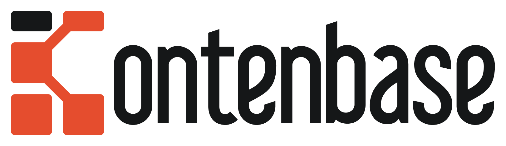

<h3>No Code Backend API, Fast and Easy!</h3>

  <a href="https://kontenbase.com" target="_blank">Kontenbase</a> allows you to easily create backend API, auth, and storage in less than 1 minute without coding.

  

  

**Think of it as a very simple alternative of:**

- JSON Placeholder
- Postman
- Strapi
- Firebase
- Supabase
- Express.js
- NestJS
- AdonisJS
- and other API-focused tools

Kontenbase is focused on enabling developers (especially front-end developers) to build back-end API (currently focused on REST API) without having to touch backend code at all. But of course, it's still possible to create a custom backend service too.

## Features

Kontenbase let you focus on the frontend and product for your end user.

- [x] Hosted Backend
- [x] Auto Generated API & SDK
- [x] Hosted Database
- [x] Database Migration
- [x] Authentication and Authorization
- [x] Realtime subscriptions
- [x] Storage
- [ ] Functions (coming soon)
- [ ] Internal Tools (coming soon)

## Documentation

Visit our documentation at [docs.kontenbase.com](https://docs.kontenbase.com)

## Support

- [GitHub Discussions](https://github.com/kontenbase/kontenbase/discussions). Mostly for anything, sharing your works, and help others.
- [GitHub Issues on Feedback](https://github.com/kontenbase/feedback/issues). Mostly for general feedback for the platform.
- [GitHub Issues on Kontenbase](https://github.com/kontenbase/kontenbase/issues). Mostly for bug reports and errors to solve.

## Status

- [x] Private Alpha: We are testing Kontenbase with a limited users. You can subscribe and fill our survey via [kontenbase.com](https://kontenbase.com) to be invited.
- [ ] Public Alpha: Anyone can sign up without any invite. It might be buggy, so please go easy. :)
- [ ] Public Beta: Stable enough to be used by anyone.
- [ ] Public: Production ready which you can use for real project and product.

We are currently in Private Alpha. Watch this repo to get notified.

## How it Works

### 1. Data Modeling

Design your API without coding. Easy!

### 2. Don't Reinvent the Wheel

From Auth, Storage, and Data Migration. Battery Included!

### 3. Try API Right in Your Browser

Publish API without Ops! No deployment time. Fast!

### 4. Consume API without Frontend Barrier

Whether React, Vue, Angular, or others. Up to you!

## Project Examples

Here are some project examples that might help you to understand how to implement <a href="https://kontenbase.com" target="_blank">Kontenbase</a> on frontend.

You can find all of them in the [`/examples`](./examples) folder in this repo.

### Todo App

- Repo: [nextjs-todo](https://github.com/kontenbase/kontenbase/tree/main/examples/nextjs-todo)
- Live Demo: [kontenbase-todo.vercel.app](https://kontenbase-todo.vercel.app)

### Blog App

- Repo: [Blog App](https://github.com/kontenbase/kontenbase/tree/main/examples/nextjs-blog)
- Live Demo: [kontenbase-blog.vercel.app](https://kontenbase-blog.vercel.app)

### Chat App

- Repo: [Chat App](https://github.com/kontenbase/kontenbase/tree/main/examples/reactjs-chat)
- Live Demo: [kontenbase-chat.vercel.app](https://kontenbase-chat.vercel.app)
